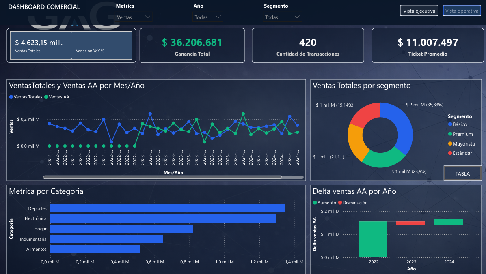
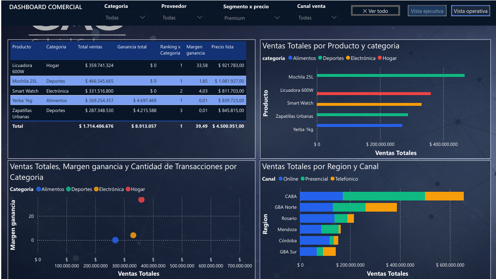

# Gabriel Galeano — Portfolio de Business Intelligence

Analista de Datos & BI con foco en Power BI: modelado dimensional, DAX, Power Query y Power BI Service. Este repositorio reúne proyectos de práctica y pruebas técnicas resueltos de punta a punta: desde datos crudos hasta un dashboard funcional.

📧 g.galeano1994@gmail.com · 💼 [linkedin.com/in/gabrielgaleanoo1994](http://www.linkedin.com/in/gabrielgaleanoo1994) · 📍 Corrientes, Argentina

---

## Proyectos

### 📊 [Modelo Comercial desde Datos Sucios](./proyecto-modelo-comercial-datos-sucios)
Construcción de un modelo analítico desde cero a partir de 4 fuentes CSV con errores reales de calidad de datos. Auditoría y limpieza en Power Query, modelado en estrella, librería de medidas DAX y dashboard comercial de 2 páginas (rentabilidad + análisis temporal/segmentación).

**Stack:** Power BI · Power Query · DAX · Modelado dimensional

### 📈 [Catman Review — Análisis de Categoría (Bebidas)](./catman-review-categoria-bebidas)
Catman Review completo de una categoría de bebidas con 7 marcas competidoras: desempeño general, por plaza, marca, segmento, sabor y mililitraje. Librería extensa de medidas DAX, detección de oportunidades y dashboard ejecutivo de 4 páginas.

**Stack:** Power BI · Power Query (unpivot) · DAX · Category Management

---

## Sobre los datos de origen

Ambos proyectos surgieron de pruebas técnicas para procesos de selección laboral. Por motivos de confidencialidad no se publican los archivos de datos originales ni los nombres de las empresas evaluadoras: cada README documenta la metodología, las decisiones técnicas y los resultados agregados del ejercicio.

## Stack técnico general

`Power BI Desktop` · `Power BI Service` · `DAX` · `Power Query` · `Modelado dimensional (esquema estrella)` · `Excel`

## Capturas

