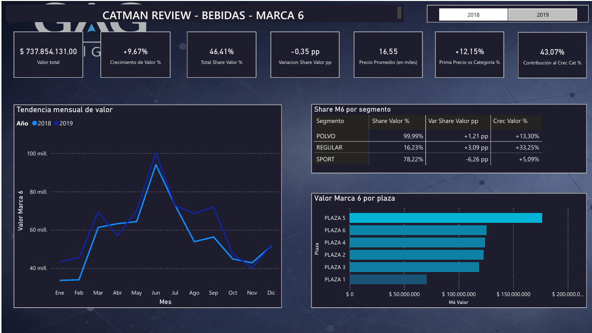
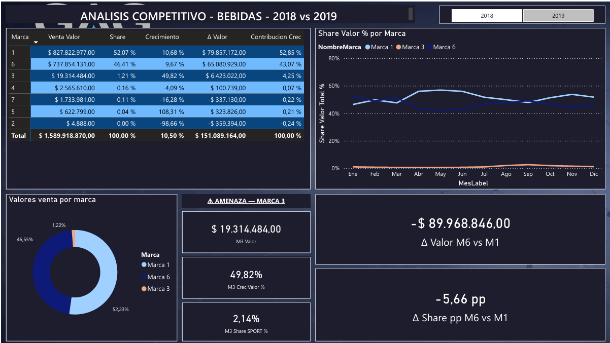
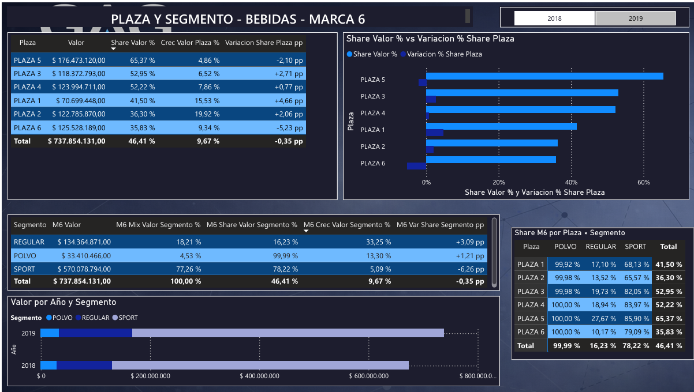
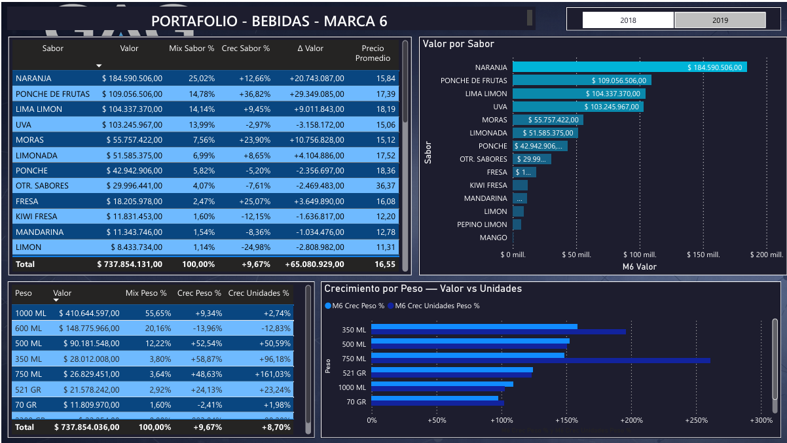

# Catman Review — Análisis de Categoría (Bebidas)

## Contexto

Prueba técnica para un proceso de selección laboral, en el rol de Ejecutivo de Category Management (Catman) para una marca de bebidas dentro de una categoría con 7 marcas competidoras. El objetivo: producir un Catman Review completo más un dashboard ejecutivo en Power BI, desde datos crudos.

> **Nota de confidencialidad:** no se publican los datos originales, ni el nombre de la empresa evaluadora, ni el nombre real de la marca (se referencia como "Marca 6", tal como fue identificada en el ejercicio).

## Fuente de datos

Planilla Excel con aproximadamente 1.900 filas de ventas de toda la categoría de bebidas: 6 plazas geográficas, 7 marcas, 24 períodos bimestrales (2018–2019), con volumen y valor por combinación de tipo de envase, segmento, sabor y mililitraje.

## Proceso

### 1. Preparación de datos
Limpieza de encabezados corruptos y *unpivot* de la estructura (de columnas por período a formato largo) para poder modelarla correctamente en Power BI.

### 2. Modelado
Tabla de hechos `FactVentas` (~31.700 filas) vinculada a dimensiones de Plaza, Marca, Segmento, Sabor y Mililitraje.

### 3. Librería de medidas DAX
Una extensa librería de medidas (cerca de 70–80) para: share de mercado, crecimiento interanual, contribución al crecimiento de la categoría y precio promedio — todas calculadas tanto en valor como en volumen.

### 4. Dashboard (4 páginas)
Desempeño general de la categoría, desempeño por plaza / marca / segmento / sabor / mililitraje, detección de oportunidades y scorecard ejecutivo en valor y volumen.

## Hallazgos principales

- La categoría creció **+11.6%** en valor; Marca 6 creció **+10.7%** — por debajo del promedio de la categoría.
- El share de Marca 6 cayó levemente, de **46.3% a 46.0%** en valor.
- Pese a la pérdida de share, Marca 6 generó el **43%** del crecimiento total de la categoría.
- **Tres focos de atención:** pérdida de share en el segmento principal de la marca (−5.8 puntos porcentuales), pérdida de share en una de las plazas pese a crecer en valor, y caída fuerte en el formato de mayor volumen de venta (mililitraje líder).
- **Oportunidad identificada:** un segmento secundario creciendo **+32.9%**, aportando el 47% del crecimiento propio de la marca — la plataforma de expansión más prometedora para los próximos períodos.

## Stack técnico

`Power BI Desktop` · `Power Query (unpivot)` · `DAX` · `Modelado dimensional` · `Category Management`

  ## Capturas

